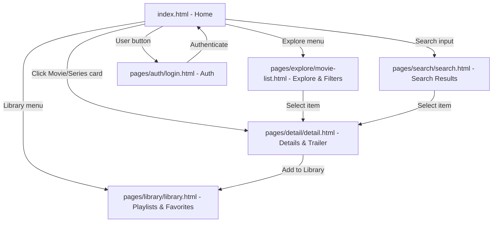

# 🎬 TopCinema

[](https://developer.mozilla.org/en-US/docs/Web/JavaScript)
[](https://developer.mozilla.org/en-US/docs/Web/HTML)
[](https://developer.mozilla.org/en-US/docs/Web/CSS)
[](https://firebase.google.com/)
[](https://www.themoviedb.org/documentation/api)

> **TopCinema** is a modern, responsive web application for exploring movies, TV series, and anime. Powered by **The Movie Database (TMDB) API** for real-time media catalogs and **Google Firebase** (Auth & Cloud Firestore) for user authentication and custom playlist/library management.

---

## 📑 Table of Contents

- [Overview](#-overview)
- [Key Features](#-key-features)
- [Tech Stack & Architecture](#-tech-stack--architecture)
- [Project Structure](#-project-structure)
- [Getting Started](#-getting-started)
  - [Prerequisites](#prerequisites)
  - [Installation & Local Server](#installation--local-server)
- [Backend & Service Integrations](#-backend--service-integrations)
  - [TMDB API & Cloudflare Proxy Integration](#1-tmdb-api--cloudflare-proxy-integration)
  - [Firebase Architecture & Security](#2-firebase-architecture--security)
- [Application Flow & Pages](#-application-flow--pages)
- [Security Considerations](#-security-considerations)
- [Future Enhancements](#-future-enhancements)
- [Attribution & Credits](#-attribution--credits)
- [Copyright & Terms of Use](#-copyright--terms-of-use)

---

## 🌟 Overview

TopCinema provides cinema enthusiasts with a smooth, streaming-platform-like user experience directly in the browser:

- Discover trending, popular, and top-rated movies and series.
- Filter catalog content by genre, media type, and sorting criteria.
- Search seamlessly across both films and TV shows with instant visual carousels.
- Inspect detailed movie/show profiles: trailers, cast, crew, ratings, release info, and genre-based recommendations.
- Register, log in, and curate custom personal playlists (e.g., _Watch Later_, _Favorites_) securely stored in the cloud.

---

## ✨ Key Features

- **🏠 Dynamic Home Showcase**:
  - Hero slider carousel displaying trending titles with high-resolution backdrops, overviews, and ratings.
  - Horizontal sliders for Trending Movies, Trending Series, Popular Movies, Popular Series, Top Rated Movies, and Top Rated Series.
- **🧭 Explore & Filtering**:
  - Interactive genre tags (Action, Sci-Fi, Drama, Romance, Thriller, Animation, etc.).
  - Multi-criteria filter options by media category (Movies, Series, Anime) and sorting (Popularity, Rating, Release Date).
  - Navigation state and scroll position preservation using `localStorage`.
- **🔍 Dual-Category Search**:
  - Real-time search supporting keyboard shortcut (`Enter`) and dedicated action button.
  - Displays matching results categorized into interactive movie and series carousels.
- **🎬 Detailed Media View (`detail.html`)**:
  - Rich metadata: HD backdrop, movie poster, vote average, duration/runtime, release year, genres, and synopsis.
  - Embedded YouTube video player for official trailers and teasers.
  - Full cast and director/crew credits.
  - Recommended titles based on matching genres.
  - Direct "Add to Library" popup modal.
- **👤 User Authentication**:
  - Client-side form validation (email format, password minimum length, confirmation checks).
  - Account creation and sign-in powered by Firebase Authentication.
  - Persistent login state and user account menu with sign-out support.
- **📚 Cloud Library & Custom Playlists**:
  - Create multiple custom playlists (e.g., _My Favorites_, _Must Watch_).
  - Add and organize movies and series to specific playlists.
  - Real-time persistence using Cloud Firestore REST API.
  - Delete individual playlist items or whole playlists.
  - Custom sorting options (Title, Rating, Date Added).
- **🎨 Modern Dark Theme**:
  - Custom CSS design system with reusable variables (`:root`).
  - Fully responsive layouts optimized for mobile, tablet, and desktop screens.

---

## 🛠️ Tech Stack & Architecture

| Layer                  | Technology                             | Description                                                                                                 |
| :--------------------- | :------------------------------------- | :---------------------------------------------------------------------------------------------------------- |
| **Frontend Core**      | HTML5, CSS3, JavaScript (ES6+)         | Vanilla JS implementation using native ES modules (`import`/`export`) without heavy framework overhead.     |
| **Styling**            | Custom CSS3 (`style.css`, `login.css`) | Custom design tokens (CSS variables), CSS Grid & Flexbox, smooth transitions, and responsive media queries. |
| **Icons & Typography** | Bootstrap Icons & Google Fonts         | `bootstrap-icons@1.11.2`, DM Sans, and Plus Jakarta Sans.                                                   |
| **Catalog API**        | The Movie Database (TMDB) API v3       | RESTful endpoints for discovering, searching, and fetching media details, credits, and videos.              |
| **Authentication**     | Firebase Authentication v11.7.1        | Secure client-side email/password authentication and session management via CDN.                            |
| **Database**           | Google Cloud Firestore (REST API)      | Serverless document database accessed via REST endpoints with JWT authorization for playlist storage.       |
| **Client Storage**     | Browser `localStorage`                 | Caches filter states, active genre, and scroll coordinates across page navigations.                         |

---

## 📂 Project Structure

```text
TopCinema/
├── assets/
│   ├── css/
│   │   └── style.css                 # Core application styling & design tokens
│   └── images/
│       ├── logo.ico                  # TopCinema favicon & brand mark
│       ├── play_circle.png           # Play trailer icon
│       ├── search.png                # Search icon
│       ├── star.png                  # Rating star icon
│       ├── tmdb-logo.png             # TMDB official badge
│       ├── tmdb-logo.svg             # TMDB vector logo
│       └── video-bg-icon.png         # Video placeholder icon
├── pages/
│   ├── auth/                         # Authentication module
│   │   ├── create.html               # Account registration view
│   │   ├── create.js                 # Registration controller
│   │   ├── login.css                 # Auth dedicated styles
│   │   ├── login.html                # User sign-in view
│   │   └── login.js                  # Login controller
│   ├── detail/                       # Media details module
│   │   ├── detail.html               # Movie & TV show details view
│   │   └── detail.js                 # Detail rendering, trailers & playlist additions
│   ├── explore/                      # Catalog exploration module
│   │   ├── movie-list.html           # Explore catalog view
│   │   └── movie-list.js             # Catalog explore, genre filtering & scroll caching
│   ├── library/                      # User playlists module
│   │   ├── library.html              # Personal library view
│   │   └── library.js                # Custom playlists CRUD via Firestore REST
│   └── search/                       # Search module
│       ├── search.html               # Search results view
│       └── search.js                 # Search queries & slider rendering
├── shared/                           # Shared services and utilities
│   ├── api.js                        # TMDB API endpoints and query builders
│   ├── config.example.js             # Configuration template (actual config.js is gitignored)
│   └── firebase.js                   # Firebase SDK initialization & auth export
├── .github/
│   └── workflows/
│       └── deploy.yml                # Automated GitHub Pages CI/CD with secret injection
├── index.html                        # Homepage entry point (hero banner, carousels)
├── index.js                          # Homepage carousel controllers & auth popover
├── .gitignore                        # Git ignore file (ignores config.js, .env)
├── GEMINI.md                         # Technical context & instructions for AI assistants
└── README.md                         # Project documentation
```

---

## 🚀 Getting Started

### Prerequisites

- A modern web browser (Google Chrome, Mozilla Firefox, Microsoft Edge, Safari) supporting ES6 Modules.
- A local HTTP development server (e.g. VS Code **Live Server**, Python HTTP server, or Node.js `serve`).

> [!IMPORTANT]
> Because TopCinema utilizes native ES6 JavaScript modules (`type="module"`), opening HTML files directly via `file://` will cause CORS restrictions in most browsers. **Always serve the project through a local web server.**

### Installation & Local Server

1. **Clone the repository**:

   ```bash
   git clone https://github.com/RafaelSantosPereira/api-project-TW.git
   cd api-project-TW
   ```

2. **Start a local development server**:
   - **Using VS Code Live Server extension**:
     Right-click `index.html` and select **"Open with Live Server"**.
   - **Using Python 3**:
     ```bash
     python -m http.server 8000
     ```
   - **Using Node.js (`npx`)**:
     ```bash
     npx serve .
     ```

3. **Open the application**:
   Open your browser and navigate to `http://localhost:8000` (or the port provided by your server).

---

## ⚙️ Backend & Service Integrations

### 1. TMDB API & Cloudflare Proxy Integration

TopCinema retrieves real-time movie and series data from **The Movie Database (TMDB) API v3** via a secure serverless proxy deployed on **Cloudflare Workers**:

- **Zero Key & Endpoint Exposure in Git**: The private TMDB API key and proxy endpoint URL are completely shielded from Git tracking. In production, the proxy URL is injected automatically via GitHub Secrets (`PROXY_URL`) during GitHub Pages deployment. Locally, it is loaded from a gitignored [`shared/config.js`](file:///c:/TopCinema/shared/config.js) file.
- **Serverless Edge Proxy**: Client requests route through the Cloudflare Worker, which injects the secret API key server-side, validates the request origin, and returns data with proper CORS headers.
- Endpoints, query parameters, and image URL builders are centrally managed in [`shared/api.js`](file:///c:/TopCinema/shared/api.js).

### 2. Firebase Architecture & Security

Authentication and user library persistence are powered by **Google Firebase**:

- **Authentication**: Managed via Firebase Auth SDK in [`shared/firebase.js`](file:///c:/TopCinema/shared/firebase.js), handling user sign-up, sign-in, session states, and JWT ID token generation.
- **Cloud Firestore (REST API)**: User playlists and playlist items are managed through Cloud Firestore using standard `fetch` calls with Bearer authorization tokens (`getIdToken()`). This keeps the client bundle ultra-lightweight without needing the entire Firestore SDK.
- **Server-Side Security Rules**: User data protection is enforced directly in Firestore Security Rules, ensuring that each authenticated user can only view, create, or delete their own playlists and saved media:

---

## 📱 Application Flow & Pages



1. **Home (`index.html`)**: Landing page showcasing featured trailers, trending selections, and categories.
2. **Explore (`pages/explore/movie-list.html`)**: Deep dive into genres, sorting, and media type filtering.
3. **Search (`pages/search/search.html`)**: Search films and series simultaneously by title keywords.
4. **Media Details (`pages/detail/detail.html`)**: Full summary, video trailer, cast credits, and playlist modal.
5. **My Library (`pages/library/library.html`)**: Manage personalized playlists stored in Firestore.
6. **Authentication (`pages/auth/login.html` & `pages/auth/create.html`)**: User registration and login flows.

---

## 🔒 Security Considerations

- **API Keys**: In a production environment, avoid committing raw API keys directly to public repositories. Consider configuring proxy endpoints or utilizing serverless functions (e.g. Firebase Functions or Cloudflare Workers) to secure third-party credentials.
- **Client Validation**: All auth inputs include client-side verification, but server-side rule verification in Firebase ensures robust security.

---

## 🤝 Attribution & Credits

- **TMDB API**: This product uses the TMDB API but is not endorsed or certified by TMDB.
- **Icons**: [Bootstrap Icons](https://icons.getbootstrap.com/)
- **Fonts**: [Google Fonts](https://fonts.google.com/) (DM Sans, Plus Jakarta Sans)
- **Author**: Rafael Pereira ([@RafaelSantosPereira](https://github.com/RafaelSantosPereira))

---

## 📄 Copyright & Terms of Use

**Copyright © 2026 Rafael Santos Pereira. All rights reserved.**

This project and its source code are published solely for personal portfolio display and educational evaluation purposes:

- Viewing and inspecting the codebase for portfolio review and learning is welcome.
- Unauthorized copying, reproduction, modification, distribution, or commercial use of this project or its code is strictly prohibited without prior written consent from the author.
